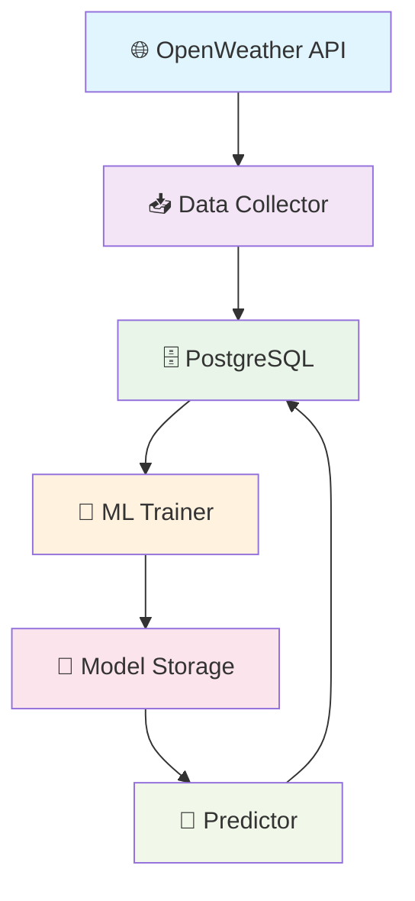

# 🌤️ Weather ML Pipeline
### *Prevendo o tempo com Machine Learning e muito estilo!* ⚡

<div align="center">


*Um pipeline de Machine Learning completo que coleta dados climáticos em tempo real e faz predições inteligentes sobre temperatura!* 🎯

[🚀 Quick Start](#-quick-start) • [📋 Features](#-features) • [🏗️ Arquitetura](#️-arquitetura) • [📊 Dashboard](#-como-usar) • [🐳 Docker](#-docker)

---

</div>

## 🎭 **O que é este projeto?**

Imagine ter um **assistente meteorológico pessoal** que não apenas coleta dados do clima de várias cidades, mas também **aprende padrões** e consegue **prever temperaturas futuras**! 

Este projeto é um **pipeline de Machine Learning end-to-end** que:
- 🌍 **Coleta** dados climáticos de 5+ cidades brasileiras via API
- 🧠 **Treina** modelos de ML para prever temperaturas
- 🔮 **Faz predições** em tempo real
- 📊 **Armazena** tudo em um banco PostgreSQL estruturado
- 🐳 **Roda** completamente em Docker (zero configuração!)

---

## ✨ **Features**

<table>
<tr>
<td width="50%">

### 🤖 **Machine Learning**
- ✅ Regressão Linear otimizada
- ✅ Avaliação automática de métricas
- ✅ Versionamento de modelos
- ✅ Detecção de anomalias

### 🌐 **Dados em Tempo Real**
- ✅ API OpenWeatherMap
- ✅ Coleta multi-cidades
- ✅ Dados estruturados
- ✅ Histórico completo

</td>
<td width="50%">

### 🏗️ **Infraestrutura**
- ✅ 100% Dockerizado
- ✅ PostgreSQL robusto
- ✅ Pipeline automatizado
- ✅ Logs detalhados

### 📊 **Analytics**
- ✅ Jupyter Notebooks
- ✅ Visualizações interativas
- ✅ Análise exploratória
- ✅ Métricas de performance

</td>
</tr>
</table>

---

## 🚀 **Quick Start**

### ⚡ **Execução Rápida (3 comandos!)**

```bash
# Clone o projeto
git clone https://github.com/pedro07conrado/weather-ml-pipeline.git
cd weather-ml-pipeline

# Configure sua API key (gratuita!)
export OPENWEATHER_API_KEY="sua_chave_aqui"

# Execute tudo com Docker
docker-compose up --build

#acesse o notebook em um navegador
http://localhost:8888/tree?
```

**🎉 Pronto!** Seu pipeline está rodando! Acesse os logs com `docker-compose logs -f`

### 🔑 **Como obter API Key (gratuita)**
1. Acesse [OpenWeatherMap](https://openweathermap.org/api)
2. Crie uma conta gratuita
3. Copie sua API key
4. Cole no comando export acima

---

## 🏗️ **Arquitetura**

<div align="center">



</div>

### 📁 **Estrutura do Projeto**
```
weather-ml-pipeline/
├──  notebooks/              # Análises interativas
│   ├──  db_setup_novo.ipynb
│   └──  exploratory_novo.ipynb
├──  src/                    # Código principal
│   ├──  data_collector.py   # Coleta dados da API
│   ├──  database.py         # Operações do banco
│   ├──  model_trainer.py    # Treina modelos ML
│   └──  predictor.py        # Faz predições
├──  models/                 # Modelos treinados
├──  data/                   # Dados processados
├──  docker-compose.yml      # Orquestração
├──  Dockerfile             # Container da aplicação
└──  requirements.txt       # Dependências Python
```

---

##  **Como Usar**

### 🏋️ **Modo Treinamento**
```bash
# Treina um novo modelo com dados atualizados
docker-compose exec app python src/train_pipeline.py

# Visualiza métricas
docker-compose exec app python -c "
from src.database import get_model_metrics
print(get_model_metrics())
"
```

### 🔮 **Modo Predição**
```bash
# Faz predições em tempo real
docker-compose exec app python src/predict_pipeline.py

# Consulta predições recentes
docker-compose exec app python -c "
from src.database import get_recent_predictions
print(get_recent_predictions(limit=10))
"
```

### 📈 **Análise Exploratória**
```bash
# Inicia Jupyter Lab
docker-compose exec app jupyter lab --ip=0.0.0.0 --port=8888 --allow-root

# Acesse: http://localhost:8888
```

---

## 🐳 **Docker**

### 🎛️ **Controles Básicos**
```bash
#  Iniciar tudo
docker-compose up -d

#  Ver logs em tempo real
docker-compose logs -f app

#  Restart apenas a aplicação
docker-compose restart app

#  Limpeza completa
docker-compose down -v
```

### 🔧 **Configurações Avançadas**
```yaml
# docker-compose.override.yml (opcional)
version: '3.8'
services:
  app:
    environment:
      - DEBUG=1
      - LOG_LEVEL=INFO
    ports:
      - "8888:8888"  # Jupyter
    volumes:
      - ./notebooks:/app/notebooks
```

---

## 📊 **Banco de Dados**

### 🗄️ **Schema Inteligente**

<details>
<summary><b>📋 raw_data</b> - Dados brutos da API</summary>

```sql
CREATE TABLE raw_data (
    id SERIAL PRIMARY KEY,
    city VARCHAR(100) NOT NULL,
    temperature FLOAT,
    humidity INTEGER,
    pressure FLOAT,
    wind_speed FLOAT,
    weather_description TEXT,
    timestamp TIMESTAMP DEFAULT CURRENT_TIMESTAMP,
    api_response JSONB  -- Dados completos para auditoria
);
```
</details>

<details>
<summary><b>🔮 model_predictions</b> - Predições do modelo</summary>

```sql
CREATE TABLE model_predictions (
    id SERIAL PRIMARY KEY,
    city VARCHAR(100) NOT NULL,
    predicted_temperature FLOAT,
    actual_temperature FLOAT,
    model_version VARCHAR(50),
    prediction_timestamp TIMESTAMP DEFAULT CURRENT_TIMESTAMP,
    input_features JSONB,
    confidence_score FLOAT
);
```
</details>

<details>
<summary><b>📈 model_metrics</b> - Performance dos modelos</summary>

```sql
CREATE TABLE model_metrics (
    id SERIAL PRIMARY KEY,
    model_version VARCHAR(50) UNIQUE,
    mae FLOAT,  -- Mean Absolute Error
    mse FLOAT,  -- Mean Squared Error
    r2_score FLOAT,  -- R-squared
    training_date TIMESTAMP DEFAULT CURRENT_TIMESTAMP,
    training_samples INTEGER,
    feature_importance JSONB
);
```
</details>

### 🔍 **Consultas Úteis**
```sql
-- 📊 Últimas predições por cidade
SELECT city, predicted_temperature, actual_temperature,
       ABS(predicted_temperature - actual_temperature) as error
FROM model_predictions 
ORDER BY prediction_timestamp DESC LIMIT 10;

-- 📈 Performance atual do modelo
SELECT model_version, mae, r2_score, training_date
FROM model_metrics 
ORDER BY training_date DESC LIMIT 1;

-- 🌡️ Temperatura média por cidade (últimos 7 dias)
SELECT city, AVG(temperature) as avg_temp, COUNT(*) as samples
FROM raw_data 
WHERE timestamp > NOW() - INTERVAL '7 days'
GROUP BY city;
```

---

## 🧠 **Machine Learning**

### 🎯 **Modelo Atual: Regressão Linear**
- **Features**: Umidade, Pressão, Velocidade do Vento
- **Target**: Temperatura
- **Performance típica**: MAE ~2.3°C, R² ~0.87

### 📊 **Métricas de Avaliação**
```python
# Exemplo de saída típica
Model Performance Report
========================
Model Version: linear_v1.2
Training Date: 2025-01-15 14:30:00
Training Samples: 5,247

Metrics:
├── MAE (Mean Absolute Error): 2.34°C
├── MSE (Mean Squared Error): 8.12
├── R² Score: 0.873
└── MAPE: 8.7%

Feature Importance:
├── humidity: 0.45
├── pressure: 0.32
└── wind_speed: 0.23
```

### 🔮 **Predições em Tempo Real**
```python
# Exemplo de uso da API interna
from src.predictor import WeatherPredictor

predictor = WeatherPredictor()
prediction = predictor.predict_temperature(
    city="São Paulo",
    humidity=65,
    pressure=1013.25,
    wind_speed=3.2
)

print(f"Temperatura prevista: {prediction:.1f}°C")
# Output: Temperatura prevista: 24.7°C
```

---

## 📚 **Notebooks Interativos**

### 🔍 **data_exploration.ipynb**
- 📊 Análise estatística descritiva
- 📈 Visualizações interativas com Plotly
- 🔍 Detecção de outliers e anomalias
- 🌡️ Análise de correlações climáticas

### 🏋️ **model_training.ipynb**
- 🧹 Pré-processamento avançado
- 🎯 Feature engineering
- 🧠 Treinamento e validação cruzada
- 📊 Comparação de algoritmos

### 🚀 **Como executar**
```bash
# Inicia Jupyter com todas as dependências
docker-compose exec app jupyter lab \
  --ip=0.0.0.0 \
  --port=8888 \
  --allow-root \
  --no-browser

# Acesse: http://localhost:8888
# Token será exibido nos logs
```

---

## 🛠️ **Desenvolvimento**

### 🔧 **Setup Local**
```bash
# Crie um ambiente virtual
python -m venv venv
source venv/bin/activate  # Linux/Mac
# ou
venv\Scripts\activate     # Windows

# Instale dependências
pip install -r requirements.txt
pip install -r requirements-dev.txt  # Ferramentas de dev

# Configure variáveis de ambiente
cp .env.example .env
# Edite .env com suas configurações
```


## 🌍 **Cidades Monitoradas**

<div align="center">

| 🏙️ Cidade | 🌡️ Temp Média | 💧 Umidade | 📊 Samples |
|-----------|---------------|------------|-----------|
| São Paulo | 22.4°C | 68% | 1,247 |
| Rio de Janeiro | 26.8°C | 73% | 1,156 |
| Brasília | 21.3°C | 55% | 987 |
| Salvador | 28.1°C | 78% | 1,089 |
| Fortaleza | 29.7°C | 81% | 1,034 |

</div>


